```python
# Standard data science imports
import numpy as np
import pandas as pd
# Visualization libraries
import seaborn as sns
import matplotlib.pyplot as plt
```


```python
# Set plot to ggplot for appearance
plt.style.use('ggplot')
```


```python
# Load data set into Pandas dataframe
df_teleco=pd.read_csv('c:/Users/almingah/Desktop/MSDA-WGU/D213/teleco_time_series.csv')
```


```python
df_teleco.head()
```


<div>
<style scoped>
    .dataframe tbody tr th:only-of-type {
        vertical-align: middle;
    }

    .dataframe tbody tr th {
        vertical-align: top;
    }

    .dataframe thead th {
        text-align: right;
    }
</style>
<table border="1" class="dataframe">
  <thead>
    <tr style="text-align: right;">
      <th></th>
      <th>Day</th>
      <th>Revenue</th>
    </tr>
  </thead>
  <tbody>
    <tr>
      <th>0</th>
      <td>1</td>
      <td>0.000000</td>
    </tr>
    <tr>
      <th>1</th>
      <td>2</td>
      <td>0.000793</td>
    </tr>
    <tr>
      <th>2</th>
      <td>3</td>
      <td>0.825542</td>
    </tr>
    <tr>
      <th>3</th>
      <td>4</td>
      <td>0.320332</td>
    </tr>
    <tr>
      <th>4</th>
      <td>5</td>
      <td>1.082554</td>
    </tr>
  </tbody>
</table>
</div>


```python
#  line graph visualizing the realization of the time series
plt.figure(figsize=(18, 6))
plt.plot( df_teleco['Day'], df_teleco['Revenue'], color='tab:blue')
plt. xlabel('Time(Day)')
plt.ylabel('Revenue in millions, USD')
plt.title(' Revenue for The last two years')
plt.show()

```


    
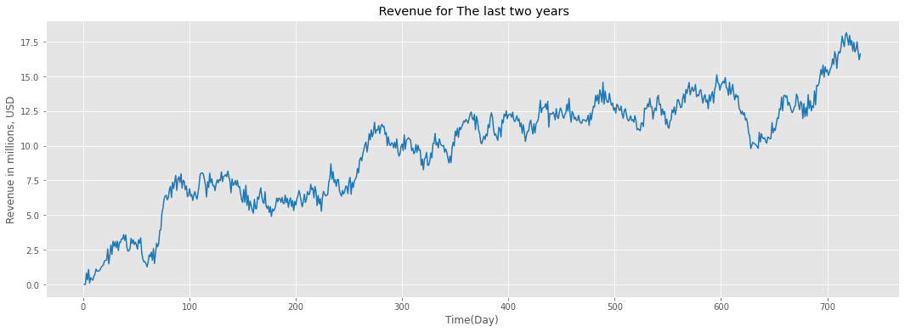
    


```python
# Get dataset size
df_teleco.shape
```


    (731, 2)


```python
# view statistics of dataset
df_teleco.describe()
```


<div>
<style scoped>
    .dataframe tbody tr th:only-of-type {
        vertical-align: middle;
    }

    .dataframe tbody tr th {
        vertical-align: top;
    }

    .dataframe thead th {
        text-align: right;
    }
</style>
<table border="1" class="dataframe">
  <thead>
    <tr style="text-align: right;">
      <th></th>
      <th>Day</th>
      <th>Revenue</th>
    </tr>
  </thead>
  <tbody>
    <tr>
      <th>count</th>
      <td>731.000000</td>
      <td>731.000000</td>
    </tr>
    <tr>
      <th>mean</th>
      <td>366.000000</td>
      <td>9.822901</td>
    </tr>
    <tr>
      <th>std</th>
      <td>211.165812</td>
      <td>3.852645</td>
    </tr>
    <tr>
      <th>min</th>
      <td>1.000000</td>
      <td>0.000000</td>
    </tr>
    <tr>
      <th>25%</th>
      <td>183.500000</td>
      <td>6.872836</td>
    </tr>
    <tr>
      <th>50%</th>
      <td>366.000000</td>
      <td>10.785571</td>
    </tr>
    <tr>
      <th>75%</th>
      <td>548.500000</td>
      <td>12.566911</td>
    </tr>
    <tr>
      <th>max</th>
      <td>731.000000</td>
      <td>18.154769</td>
    </tr>
  </tbody>
</table>
</div>


```python
# Get info
df_teleco.info()
```

    <class 'pandas.core.frame.DataFrame'>
    RangeIndex: 731 entries, 0 to 730
    Data columns (total 2 columns):
     #   Column   Non-Null Count  Dtype  
    ---  ------   --------------  -----  
     0   Day      731 non-null    int64  
     1   Revenue  731 non-null    float64
    dtypes: float64(1), int64(1)
    memory usage: 11.5 KB
    


```python
# check dataset for missing data points
df_nulls = df_teleco.isnull().sum()
print(df_nulls)
```

    Day        0
    Revenue    0
    dtype: int64
    


```python
# check for duplicates in Day
print(df_teleco.Day.duplicated().sum())
```

    0
    


```python
#Check for NAs
print(df_teleco.isna().sum())
```

    Day        0
    Revenue    0
    dtype: int64
    


```python
# Visualize missing values in dataset (GeeksForGeeks, p. 1)
import missingno as msno
msno.matrix(df_teleco);
```


    
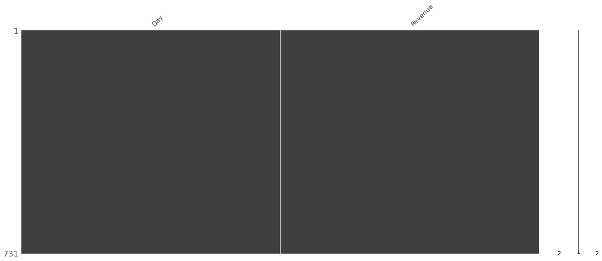
    


```python
# Import adfuller  and order libraries
from statsmodels.tsa.stattools import adfuller
from statsmodels.graphics.tsaplots import plot_acf, plot_pacf
import statsmodels.tsa.stattools as ts
from statsmodels.tsa.seasonal import seasonal_decompose
import statsmodels.api as sm
from sklearn.metrics import mean_squared_error
from statsmodels.tools.eval_measures import rmse

```


```python
# instantiate adfuller (VERMA, Y. 2021)
adft = adfuller(df_teleco.iloc[:, 1].values, autolag='AIC')
print("1. ADF c-value : ",adft[0])
print("2. P-Value : ", adft[1])
print("3. Num Of Lags : ", adft[2])
print("4. Num Of Observations Used :", adft[3])
print("5. Critical Values :")
for key, val in adft[4].items():
    print("\t",key, ": ", val)
```

    1. ADF c-value :  -1.9246121573101826
    2. P-Value :  0.3205728150793969
    3. Num Of Lags :  1
    4. Num Of Observations Used : 729
    5. Critical Values :
    	 1% :  -3.4393520240470554
    	 5% :  -2.8655128165959236
    	 10% :  -2.5688855736949163
    


```python
#set up Stationairty test
def test_stationarity(timeseries):
    #Determing rolling statistics
    rolmean = timeseries.rolling(window=30).mean()
    rolstd = timeseries.rolling(window=30).std()

    #Plot rolling statistics:
    orig = plt.plot(timeseries, color='blue',label='Original')
    mean = plt.plot(rolmean, color='red', label='Rolling Mean')
    std = plt.plot(rolstd, color='black', label = 'Rolling Std')
    plt.legend(loc='best')
    plt.title('Rolling Mean & Standard Deviation')
    plt.show(block=False)

```


```python
 # perform test on entire dataset( again, the mean is not zero, hence dataset not stationary)
test_stationarity(df_teleco['Revenue'])
```


    
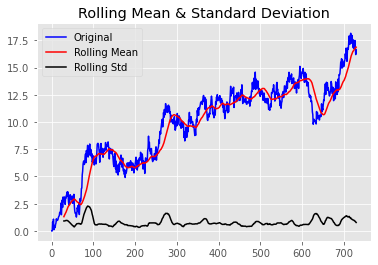
    


```python
# split dataset into training and test sets with 80% for training(  80% of 731 days= 585)
df_teleco['Day'] = df_teleco.index
df_train = df_teleco[:585]

```


```python
# 20% Test ( from row 585 to the end of the data)
df_test = df_teleco[585:]

```


```python
# Plot training and test datasets 
plt.figure(figsize=(10, 4))
plt.plot(df_train['Revenue'], color='black')
plt.plot(df_test['Revenue'], color='blue')
plt.title('Train_Test Split ')
plt.xlabel('Time(Days)')
plt.ylabel('Revenue in Millions, USD')
plt.show()
```


    
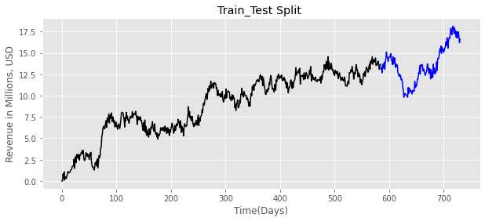
    


```python
# save a Clean dataset as csv
df_teleco.to_csv('teleco_time_series_clean.csv')
```


```python
#decompose the training dataset
decomposition=seasonal_decompose(df_train['Revenue'], model='additive', period=30)
trend=decomposition.trend
seasonal=decomposition.seasonal
residual=decomposition.resid
plt.subplot(411)
plt.plot(df_train['Revenue'],color='red', label='original_series')
plt.legend(loc='best')
plt.subplot(412)
plt.plot(trend,color='blue', label='Trend')
plt.legend(loc='best')
plt.tight_layout()
plt.subplot(414)
plt.plot(residual,color='green', label='Residual')
plt.legend(loc='best')
plt.tight_layout()
plt.subplot(413)
plt.plot(seasonal,color='brown', label='Seasonality')
plt.legend(loc='best')
plt.tight_layout()
plt.show()
```


    
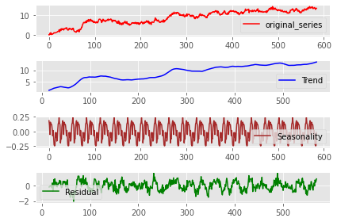
    


```python
# Plot the trend component only
plt.figure(figsize=(12, 4))
plt.plot(trend, color='tab:blue')
plt.xlabel('Day')
plt.ylabel('Revenue Trend')
plt.title('Decomposed Revenue Trend')
plt.show()
```


    
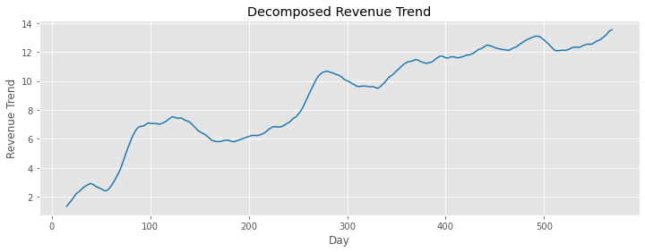
    


```python
#Plot autocorrelation function on training set
plot_acf(df_train['Revenue']);
```


    
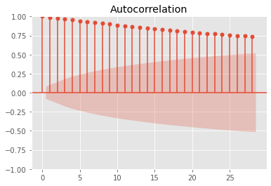
    


```python
#Plot partial autocorrelation function on training set
plot_pacf(df_train['Revenue'], method='ywm')
```


    
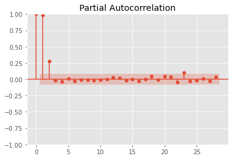
    


    

    


```python
# Run spectral density function
plt.psd(df_teleco['Revenue'])
```


    (array([6.97387711e+03, 3.91439441e+03, 5.47611144e+01, 1.10791953e+01,
            4.25439684e+00, 8.90767103e+00, 9.32436541e+00, 5.07699490e+00,
            4.50820186e+00, 1.97142105e+00, 3.17930644e+00, 2.05465010e+00,
            1.27856111e-01, 9.12357670e-01, 1.58928494e+00, 1.82600308e+00,
            1.37345831e+00, 1.08602805e+00, 3.71664573e-01, 4.01447712e-01,
            6.67019362e-01, 4.28134847e-01, 1.08303874e+00, 5.05461139e-01,
            1.49612021e-01, 2.01156666e-01, 2.01929017e-01, 3.62482513e-02,
            4.74386760e-01, 5.46619399e-01, 2.44460915e-01, 4.75225583e-01,
            2.85007556e-01, 7.59631735e-02, 2.43183009e-01, 7.19503505e-02,
            3.60475608e-01, 2.18971480e-01, 1.23421972e-01, 1.69234109e-01,
            1.69371921e-01, 1.14748035e-01, 2.14144408e-01, 2.82736486e-01,
            3.17059554e-02, 1.62458482e-02, 3.98324693e-02, 6.38895068e-02,
            4.57061837e-02, 6.54718394e-02, 1.72598760e-01, 1.32802101e-01,
            6.74716970e-02, 1.61089989e-02, 1.42266347e-01, 1.23640967e-01,
            4.30737122e-02, 8.17619769e-02, 3.95102804e-02, 4.74833201e-02,
            1.73085344e-02, 1.32485092e-02, 7.14595244e-02, 2.04348554e-01,
            4.51051907e-02, 5.55609932e-02, 5.26341931e-02, 8.68327071e-02,
            5.86340275e-02, 2.88124318e-02, 3.23398046e-03, 2.85277556e-02,
            1.03859619e-01, 6.85761289e-02, 8.53467489e-02, 1.65815053e-01,
            1.53444767e-01, 1.97776090e-01, 2.33413022e-01, 6.95161339e-02,
            4.68937467e-02, 1.53353843e-01, 1.21391009e-01, 5.34892233e-02,
            7.17250734e-02, 5.68272472e-02, 1.87708648e-01, 8.92439810e-02,
            4.25453689e-02, 9.79721726e-02, 1.63975102e-02, 8.61687997e-02,
            6.31239429e-02, 3.34886298e-02, 1.09875888e-02, 3.83717041e-02,
            8.81504336e-02, 2.89832055e-01, 1.01621880e-01, 2.88982189e-01,
            5.81784635e-01, 3.29483923e-01, 8.00152896e-02, 7.31104074e-02,
            3.39216170e-02, 3.93543037e-02, 2.55189466e-02, 8.36160222e-02,
            5.48857747e-02, 8.78315482e-02, 1.10183077e-01, 1.37188728e-01,
            1.60562556e-01, 9.01524835e-02, 1.87554502e-01, 1.29971998e-01,
            3.71787543e-02, 6.31650566e-02, 1.65356465e-01, 1.58164919e-01,
            2.17681939e-01, 3.85248684e-01, 3.04221135e-01, 4.32125608e-01,
            2.94750935e-01, 1.22618052e-02, 2.74845469e-01, 2.10555482e-01,
            3.28604031e-03]),
     array([0.       , 0.0078125, 0.015625 , 0.0234375, 0.03125  , 0.0390625,
            0.046875 , 0.0546875, 0.0625   , 0.0703125, 0.078125 , 0.0859375,
            0.09375  , 0.1015625, 0.109375 , 0.1171875, 0.125    , 0.1328125,
            0.140625 , 0.1484375, 0.15625  , 0.1640625, 0.171875 , 0.1796875,
            0.1875   , 0.1953125, 0.203125 , 0.2109375, 0.21875  , 0.2265625,
            0.234375 , 0.2421875, 0.25     , 0.2578125, 0.265625 , 0.2734375,
            0.28125  , 0.2890625, 0.296875 , 0.3046875, 0.3125   , 0.3203125,
            0.328125 , 0.3359375, 0.34375  , 0.3515625, 0.359375 , 0.3671875,
            0.375    , 0.3828125, 0.390625 , 0.3984375, 0.40625  , 0.4140625,
            0.421875 , 0.4296875, 0.4375   , 0.4453125, 0.453125 , 0.4609375,
            0.46875  , 0.4765625, 0.484375 , 0.4921875, 0.5      , 0.5078125,
            0.515625 , 0.5234375, 0.53125  , 0.5390625, 0.546875 , 0.5546875,
            0.5625   , 0.5703125, 0.578125 , 0.5859375, 0.59375  , 0.6015625,
            0.609375 , 0.6171875, 0.625    , 0.6328125, 0.640625 , 0.6484375,
            0.65625  , 0.6640625, 0.671875 , 0.6796875, 0.6875   , 0.6953125,
            0.703125 , 0.7109375, 0.71875  , 0.7265625, 0.734375 , 0.7421875,
            0.75     , 0.7578125, 0.765625 , 0.7734375, 0.78125  , 0.7890625,
            0.796875 , 0.8046875, 0.8125   , 0.8203125, 0.828125 , 0.8359375,
            0.84375  , 0.8515625, 0.859375 , 0.8671875, 0.875    , 0.8828125,
            0.890625 , 0.8984375, 0.90625  , 0.9140625, 0.921875 , 0.9296875,
            0.9375   , 0.9453125, 0.953125 , 0.9609375, 0.96875  , 0.9765625,
            0.984375 , 0.9921875, 1.       ]))


    
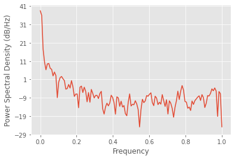
    


```python
# transform the original dataset by differencing to attain stationarity and remove trend
diff_df = np.diff(df_teleco['Revenue'], axis=0)
```


```python
#decompose and plot again after differencing
decomposition=seasonal_decompose(diff_df, model='additive', period=30)
trend=decomposition.trend
seasonal=decomposition.seasonal
residual=decomposition.resid
plt.subplot(411)
plt.plot(df_train['Revenue'],color='red', label='original_series')
plt.legend(loc='best')
plt.subplot(412)
plt.plot(trend,color='blue', label='Trend')
plt.legend(loc='best')
plt.tight_layout()
plt.subplot(414)
plt.plot(residual,color='green', label='Residual')
plt.legend(loc='best')
plt.tight_layout()
plt.subplot(413)
plt.plot(seasonal,color='brown', label='Seasonality')
plt.legend(loc='best')
plt.tight_layout()
plt.show()
```


    
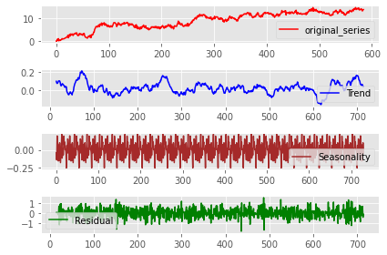
    


```python
# Plot the trend component only again to confirm trend is eliminated
plt.figure(figsize=(12, 4))
plt.plot(trend, color='tab:blue')
plt.xlabel('Day')
plt.ylabel('Revenue Trend')
plt.title('Decomposed  and differenced Revenue Trend')
plt.show()
```


    
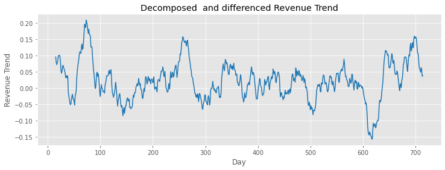
    


```python
#Plot the residuals( errors, basically zeros)
plt.plot(diff_df)
plt.show()
```


    
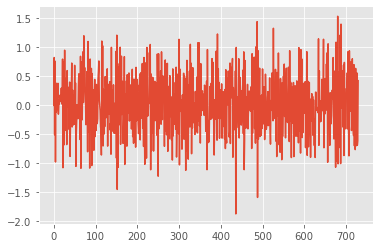
    


```python
# Run adfuller test on the differenced DataFrame again to check for stationarity.
#This time P-value is zero<0.05, hence data is stationary and ready for ARIMA

adft_diff = adfuller(diff_df, autolag='AIC')
print("1. ADF c-value : ",adft_diff[0])
print("2. P-Value : ", adft_diff[1])
print("3. Num Of Lags : ", adft_diff[2])
print("4. Num Of Observations Used :", adft_diff[3])
print("5. Critical Values :")
for key, val in adft[4].items():
    print("\t",key, ": ", val)
```

    1. ADF c-value :  -44.874527193875984
    2. P-Value :  0.0
    3. Num Of Lags :  0
    4. Num Of Observations Used : 729
    5. Critical Values :
    	 1% :  -3.4393520240470554
    	 5% :  -2.8655128165959236
    	 10% :  -2.5688855736949163
    


```python
#Test for stationarity again after differencing( confirmation, mean is virtually zero and constant)
diff_dff=pd.DataFrame(diff_df)
test_stationarity(diff_dff)
```


    
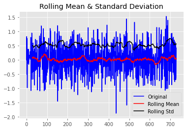
    


```python
# Import auto_arima class
from pmdarima import auto_arima
from statsmodels.tsa.arima.model import ARIMA
```


```python
# running the auto ARIMA model to find the best model that minimizes AIC.
arima_model = auto_arima(df_teleco['Revenue'], start_P=0,
                        start_q=0,
                        max_p=2,
                        max_q=2,
                        m=30,
                        seasonal=True,
                        d=1,
                        D=1,
                        trace=True,
                        error_action='ignore',
                        suppress_warnings=True,
                        stepwise=True)
arima_model.summary()
```

    Performing stepwise search to minimize aic
     ARIMA(2,1,0)(0,1,1)[30]             : AIC=inf, Time=212.11 sec
     ARIMA(0,1,0)(0,1,0)[30]             : AIC=1617.639, Time=1.27 sec
     ARIMA(1,1,0)(1,1,0)[30]             : AIC=1258.291, Time=10.41 sec
     ARIMA(0,1,1)(0,1,1)[30]             : AIC=inf, Time=154.47 sec
     ARIMA(1,1,0)(0,1,0)[30]             : AIC=1453.122, Time=2.28 sec
     ARIMA(1,1,0)(2,1,0)[30]             : AIC=1151.386, Time=58.83 sec
     ARIMA(1,1,0)(2,1,1)[30]             : AIC=inf, Time=281.73 sec
     ARIMA(1,1,0)(1,1,1)[30]             : AIC=inf, Time=212.73 sec
     ARIMA(0,1,0)(2,1,0)[30]             : AIC=1340.891, Time=31.82 sec
     ARIMA(2,1,0)(2,1,0)[30]             : AIC=1153.381, Time=80.14 sec
     ARIMA(1,1,1)(2,1,0)[30]             : AIC=1153.382, Time=87.75 sec
     ARIMA(0,1,1)(2,1,0)[30]             : AIC=1194.259, Time=62.15 sec
     ARIMA(2,1,1)(2,1,0)[30]             : AIC=1152.911, Time=169.81 sec
     ARIMA(1,1,0)(2,1,0)[30] intercept   : AIC=1153.380, Time=278.64 sec
    
    Best model:  ARIMA(1,1,0)(2,1,0)[30]          
    Total fit time: 1647.332 seconds
    


<table class="simpletable">
<caption>SARIMAX Results</caption>
<tr>
  <th>Dep. Variable:</th>                  <td>y</td>               <th>  No. Observations:  </th>    <td>731</td>  
</tr>
<tr>
  <th>Model:</th>           <td>SARIMAX(1, 1, 0)x(2, 1, 0, 30)</td> <th>  Log Likelihood     </th> <td>-571.693</td>
</tr>
<tr>
  <th>Date:</th>                   <td>Sat, 02 Apr 2022</td>        <th>  AIC                </th> <td>1151.386</td>
</tr>
<tr>
  <th>Time:</th>                       <td>01:31:21</td>            <th>  BIC                </th> <td>1169.590</td>
</tr>
<tr>
  <th>Sample:</th>                         <td>0</td>               <th>  HQIC               </th> <td>1158.423</td>
</tr>
<tr>
  <th></th>                             <td> - 731</td>             <th>                     </th>     <td> </td>   
</tr>
<tr>
  <th>Covariance Type:</th>               <td>opg</td>              <th>                     </th>     <td> </td>   
</tr>
</table>
<table class="simpletable">
<tr>
      <td></td>        <th>coef</th>     <th>std err</th>      <th>z</th>      <th>P>|z|</th>  <th>[0.025</th>    <th>0.975]</th>  
</tr>
<tr>
  <th>ar.L1</th>    <td>   -0.4898</td> <td>    0.034</td> <td>  -14.216</td> <td> 0.000</td> <td>   -0.557</td> <td>   -0.422</td>
</tr>
<tr>
  <th>ar.S.L30</th> <td>   -0.7098</td> <td>    0.037</td> <td>  -19.319</td> <td> 0.000</td> <td>   -0.782</td> <td>   -0.638</td>
</tr>
<tr>
  <th>ar.S.L60</th> <td>   -0.4028</td> <td>    0.035</td> <td>  -11.425</td> <td> 0.000</td> <td>   -0.472</td> <td>   -0.334</td>
</tr>
<tr>
  <th>sigma2</th>   <td>    0.2915</td> <td>    0.015</td> <td>   19.261</td> <td> 0.000</td> <td>    0.262</td> <td>    0.321</td>
</tr>
</table>
<table class="simpletable">
<tr>
  <th>Ljung-Box (L1) (Q):</th>     <td>0.00</td> <th>  Jarque-Bera (JB):  </th> <td>0.89</td>
</tr>
<tr>
  <th>Prob(Q):</th>                <td>0.99</td> <th>  Prob(JB):          </th> <td>0.64</td>
</tr>
<tr>
  <th>Heteroskedasticity (H):</th> <td>0.99</td> <th>  Skew:              </th> <td>0.05</td>
</tr>
<tr>
  <th>Prob(H) (two-sided):</th>    <td>0.96</td> <th>  Kurtosis:          </th> <td>3.15</td>
</tr>
</table><br/><br/>Warnings:<br/>[1] Covariance matrix calculated using the outer product of gradients (complex-step).


```python
# Build SARIMAX model on the train Data set using the (p,d,q)(P,D,Q)m results from the model above
model_SAR = sm.tsa.SARIMAX(df_train['Revenue'], order=(1, 1, 0), seasonal_order=(2, 1, 0, 30))
SARIMAX_Results = model_SAR.fit()

# Print results tables
print(SARIMAX_Results.summary())

```

                                         SARIMAX Results                                      
    ==========================================================================================
    Dep. Variable:                            Revenue   No. Observations:                  585
    Model:             SARIMAX(1, 1, 0)x(2, 1, 0, 30)   Log Likelihood                -445.222
    Date:                            Sat, 02 Apr 2022   AIC                            898.443
    Time:                                    01:32:22   BIC                            915.712
    Sample:                                         0   HQIC                           905.189
                                                - 585                                         
    Covariance Type:                              opg                                         
    ==============================================================================
                     coef    std err          z      P>|z|      [0.025      0.975]
    ------------------------------------------------------------------------------
    ar.L1         -0.4975      0.037    -13.290      0.000      -0.571      -0.424
    ar.S.L30      -0.7178      0.042    -17.200      0.000      -0.800      -0.636
    ar.S.L60      -0.4153      0.039    -10.662      0.000      -0.492      -0.339
    sigma2         0.2815      0.016     17.165      0.000       0.249       0.314
    ===================================================================================
    Ljung-Box (L1) (Q):                   0.06   Jarque-Bera (JB):                 0.92
    Prob(Q):                              0.80   Prob(JB):                         0.63
    Heteroskedasticity (H):               0.98   Skew:                            -0.03
    Prob(H) (two-sided):                  0.87   Kurtosis:                         3.19
    ===================================================================================
    
    Warnings:
    [1] Covariance matrix calculated using the outer product of gradients (complex-step).
    


```python
# call out forecast function
result_SAR = SARIMAX_Results.get_forecast()
```


```python
# prediction on test set( 20% test, 80% train)

predictions = SARIMAX_Results.predict(585, 730, typ = 'levels').rename('Predictions')

#Predict with respect to test set
plt.figure(figsize=(14, 6))
plt.plot(df_train['Revenue'], 'o-', color='black', label = '80% Train Dataset')
plt.plot(df_test['Revenue'], 'o-',  color='blue', label = '20% Test Dataset')
plt.plot(predictions, 'o-', color='red', label = 'Predictions')
plt.title('Teleco Revenue Predictions')
plt.xlabel('Day')
plt.ylabel('Revenue, USD')
plt.legend(loc='best', fontsize = 8)
plt.show()


```


    
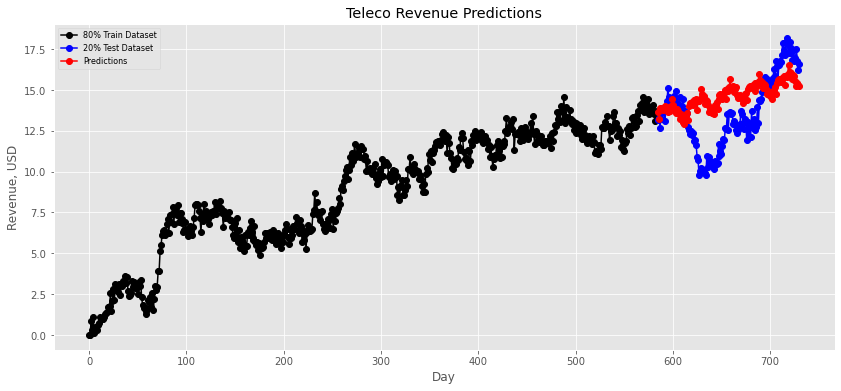
    


```python
#Summary computations on test set
test_first= df_test['Revenue'].values.astype('float32')
forecast_test = result_SAR.predicted_mean
```


```python
print('Expected : %.2f' % forecast_test)
print('Forecasted : %.2f' % test_first[0])
print('Standard Error : %.2f' % result_SAR.se_mean)

```

    Expected : 13.68
    Forecasted : 13.15
    Standard Error : 0.53
    


```python
# confident intervals
intervals = [0.2, 0.1, 0.05, 0.01]
for a in intervals:
                ci = result_SAR.conf_int(alpha=a)
                print('%.1f%% Confidence Level: %.2f between %.2f and %.2f' % ((1 - a) * 100, forecast_test, ci['lower Revenue'], ci['upper Revenue']))
ci
```

    80.0% Confidence Level: 13.68 between 13.00 and 14.36
    90.0% Confidence Level: 13.68 between 12.81 and 14.55
    95.0% Confidence Level: 13.68 between 12.64 and 14.72
    99.0% Confidence Level: 13.68 between 12.31 and 15.04
    


<div>
<style scoped>
    .dataframe tbody tr th:only-of-type {
        vertical-align: middle;
    }

    .dataframe tbody tr th {
        vertical-align: top;
    }

    .dataframe thead th {
        text-align: right;
    }
</style>
<table border="1" class="dataframe">
  <thead>
    <tr style="text-align: right;">
      <th></th>
      <th>lower Revenue</th>
      <th>upper Revenue</th>
    </tr>
  </thead>
  <tbody>
    <tr>
      <th>585</th>
      <td>12.311256</td>
      <td>15.044417</td>
    </tr>
  </tbody>
</table>
</div>


```python
# Run Mean Squared Error
MSE = mean_squared_error(df_test['Revenue'], predictions)
print('Summary')
print('MSE: ', round(MSE, 4))

# Run Root Mean Squared Error
RMSE = rmse(df_test['Revenue'], predictions)
print('RMSE: ', round(RMSE, 4))
```

    Summary
    MSE:  4.5606
    RMSE:  2.1356
    


```python
# make predictions with respect to the complete dataset
model00 = sm.tsa.statespace.SARIMAX(df_teleco['Revenue'],order=(1, 1, 0), seasonal_order=(2, 1, 0, 30))
results00 = model00.fit()
# Print results tables
print(results00.summary())
```

                                         SARIMAX Results                                      
    ==========================================================================================
    Dep. Variable:                            Revenue   No. Observations:                  731
    Model:             SARIMAX(1, 1, 0)x(2, 1, 0, 30)   Log Likelihood                -571.693
    Date:                            Sat, 02 Apr 2022   AIC                           1151.386
    Time:                                    01:33:25   BIC                           1169.590
    Sample:                                         0   HQIC                          1158.423
                                                - 731                                         
    Covariance Type:                              opg                                         
    ==============================================================================
                     coef    std err          z      P>|z|      [0.025      0.975]
    ------------------------------------------------------------------------------
    ar.L1         -0.4898      0.034    -14.216      0.000      -0.557      -0.422
    ar.S.L30      -0.7098      0.037    -19.319      0.000      -0.782      -0.638
    ar.S.L60      -0.4028      0.035    -11.425      0.000      -0.472      -0.334
    sigma2         0.2915      0.015     19.261      0.000       0.262       0.321
    ===================================================================================
    Ljung-Box (L1) (Q):                   0.00   Jarque-Bera (JB):                 0.89
    Prob(Q):                              0.99   Prob(JB):                         0.64
    Heteroskedasticity (H):               0.99   Skew:                             0.05
    Prob(H) (two-sided):                  0.96   Kurtosis:                         3.15
    ===================================================================================
    
    Warnings:
    [1] Covariance matrix calculated using the outer product of gradients (complex-step).
    


```python
# Forecast for the following quarter on the entire dataset( 2 years=731, 822=731+ 91, 91=quarter of 3 months)
forecast00 = results00.predict(731, 822, typ = 'level').rename('Teleco Forecast')


# plot predicted values
plt.figure(figsize=(14,6))
plt.plot(df_teleco['Revenue'], 'o-', color='black', label='Revenue Past')
plt.plot(forecast00, 'o-', color='red', label='Revenue Forecast' )
plt.legend(loc='best')
plt.show()
```


    
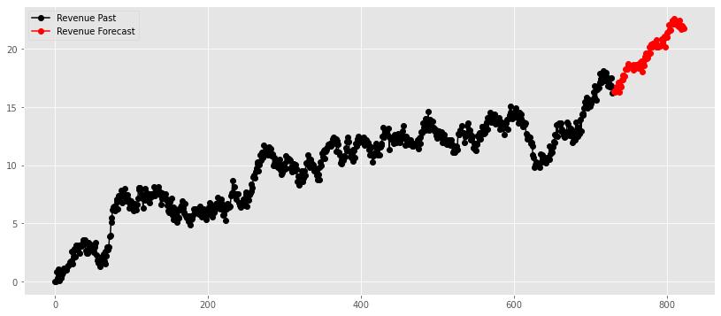
    


```python
# Plot all for comparison
plt.figure(figsize=(14, 6))
plt.plot(df_train['Revenue'], 'o-', color='black', label = '80% Train Dataset')
plt.plot(df_test['Revenue'], 'o-',  color='blue', label = '20% Test Dataset')
plt.plot(predictions, 'o-', color='green', label = 'Predictions on test set')
plt.plot(forecast00, 'o-', color='red', label='Revenue Forecast' )
plt.title('Teleco Revenue Predictions/forecast')
plt.xlabel('Day')
plt.ylabel('Revenue, USD')
plt.legend(loc='best', fontsize = 8)
plt.show()
```


    
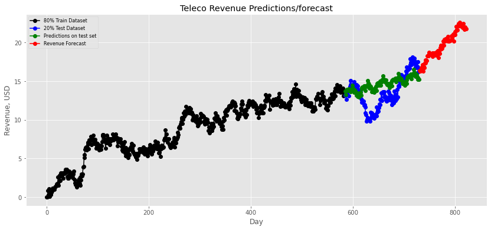
    


```python
#Try ARIMA model instead of Seasonal ARIMA
model_arima = ARIMA(df_teleco['Revenue'], order=(1,1,0))  
results_ARIMA = model_arima.fit()
plt.plot(df_teleco['Revenue'], color='blue')
plt.plot(results_ARIMA.fittedvalues, color='red')
plt.show()


# summary of fit model
print('summary of fit model', results_ARIMA.summary())


# line plot of residuals
residuals = pd.DataFrame(results_ARIMA.resid)
residuals.plot()
plt.title('line plot of residuals')
plt.show()


# density plot of residuals
residuals.plot(kind='kde')
plt.title('density plot of residuals')
plt.show()

# summary stats of residuals
print( 'summary stats of residuals', residuals.describe())
```


    
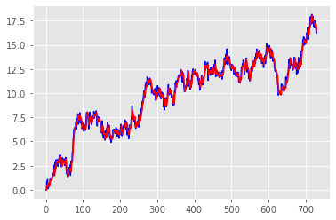
    


    summary of fit model                                SARIMAX Results                                
    ==============================================================================
    Dep. Variable:                Revenue   No. Observations:                  731
    Model:                 ARIMA(1, 1, 0)   Log Likelihood                -490.355
    Date:                Sat, 02 Apr 2022   AIC                            984.710
    Time:                        01:33:28   BIC                            993.896
    Sample:                             0   HQIC                           988.254
                                    - 731                                         
    Covariance Type:                  opg                                         
    ==============================================================================
                     coef    std err          z      P>|z|      [0.025      0.975]
    ------------------------------------------------------------------------------
    ar.L1         -0.4667      0.033    -14.213      0.000      -0.531      -0.402
    sigma2         0.2243      0.013     17.782      0.000       0.200       0.249
    ===================================================================================
    Ljung-Box (L1) (Q):                   0.00   Jarque-Bera (JB):                 2.07
    Prob(Q):                              0.98   Prob(JB):                         0.36
    Heteroskedasticity (H):               1.02   Skew:                            -0.02
    Prob(H) (two-sided):                  0.89   Kurtosis:                         2.74
    ===================================================================================
    
    Warnings:
    [1] Covariance matrix calculated using the outer product of gradients (complex-step).
    


    
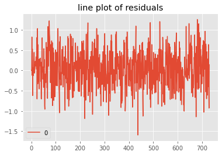
    


    
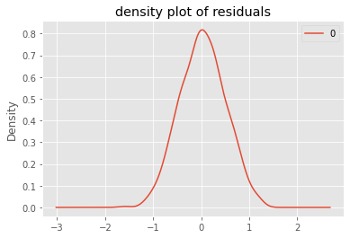
    


    summary stats of residuals                 0
    count  731.000000
    mean     0.033076
    std      0.472444
    min     -1.593322
    25%     -0.303294
    50%      0.025629
    75%      0.344243
    max      1.257543
    


```python
!pip install nbconvert[webpdf--allow-chromium-download]

```

    Requirement already satisfied: nbconvert[webpdf--allow-chromium-download] in c:\users\almingah\anaconda3\lib\site-packages (6.0.7)

      WARNING: nbconvert 6.0.7 does not provide the extra 'webpdf--allow-chromium-download'
    

    
    Requirement already satisfied: bleach in c:\users\almingah\anaconda3\lib\site-packages (from nbconvert[webpdf--allow-chromium-download]) (3.2.1)
    Requirement already satisfied: mistune<2,>=0.8.1 in c:\users\almingah\anaconda3\lib\site-packages (from nbconvert[webpdf--allow-chromium-download]) (0.8.4)
    Requirement already satisfied: testpath in c:\users\almingah\anaconda3\lib\site-packages (from nbconvert[webpdf--allow-chromium-download]) (0.4.4)
    Requirement already satisfied: defusedxml in c:\users\almingah\anaconda3\lib\site-packages (from nbconvert[webpdf--allow-chromium-download]) (0.6.0)
    Requirement already satisfied: pandocfilters>=1.4.1 in c:\users\almingah\anaconda3\lib\site-packages (from nbconvert[webpdf--allow-chromium-download]) (1.4.3)
    Requirement already satisfied: entrypoints>=0.2.2 in c:\users\almingah\anaconda3\lib\site-packages (from nbconvert[webpdf--allow-chromium-download]) (0.3)
    Requirement already satisfied: nbclient<0.6.0,>=0.5.0 in c:\users\almingah\anaconda3\lib\site-packages (from nbconvert[webpdf--allow-chromium-download]) (0.5.1)
    Requirement already satisfied: jinja2>=2.4 in c:\users\almingah\anaconda3\lib\site-packages (from nbconvert[webpdf--allow-chromium-download]) (2.11.2)
    Requirement already satisfied: nbformat>=4.4 in c:\users\almingah\anaconda3\lib\site-packages (from nbconvert[webpdf--allow-chromium-download]) (5.0.8)
    Requirement already satisfied: pygments>=2.4.1 in c:\users\almingah\anaconda3\lib\site-packages (from nbconvert[webpdf--allow-chromium-download]) (2.7.2)
    Requirement already satisfied: jupyter-core in c:\users\almingah\anaconda3\lib\site-packages (from nbconvert[webpdf--allow-chromium-download]) (4.6.3)
    Requirement already satisfied: jupyterlab-pygments in c:\users\almingah\anaconda3\lib\site-packages (from nbconvert[webpdf--allow-chromium-download]) (0.1.2)
    Requirement already satisfied: traitlets>=4.2 in c:\users\almingah\anaconda3\lib\site-packages (from nbconvert[webpdf--allow-chromium-download]) (5.0.5)
    Requirement already satisfied: webencodings in c:\users\almingah\anaconda3\lib\site-packages (from bleach->nbconvert[webpdf--allow-chromium-download]) (0.5.1)
    Requirement already satisfied: six>=1.9.0 in c:\users\almingah\anaconda3\lib\site-packages (from bleach->nbconvert[webpdf--allow-chromium-download]) (1.15.0)
    Requirement already satisfied: packaging in c:\users\almingah\anaconda3\lib\site-packages (from bleach->nbconvert[webpdf--allow-chromium-download]) (21.3)
    Requirement already satisfied: nest-asyncio in c:\users\almingah\anaconda3\lib\site-packages (from nbclient<0.6.0,>=0.5.0->nbconvert[webpdf--allow-chromium-download]) (1.4.2)
    Requirement already satisfied: async-generator in c:\users\almingah\anaconda3\lib\site-packages (from nbclient<0.6.0,>=0.5.0->nbconvert[webpdf--allow-chromium-download]) (1.10)
    Requirement already satisfied: jupyter-client>=6.1.5 in c:\users\almingah\anaconda3\lib\site-packages (from nbclient<0.6.0,>=0.5.0->nbconvert[webpdf--allow-chromium-download]) (6.1.7)
    Requirement already satisfied: MarkupSafe>=0.23 in c:\users\almingah\anaconda3\lib\site-packages (from jinja2>=2.4->nbconvert[webpdf--allow-chromium-download]) (1.1.1)
    Requirement already satisfied: ipython-genutils in c:\users\almingah\anaconda3\lib\site-packages (from nbformat>=4.4->nbconvert[webpdf--allow-chromium-download]) (0.2.0)
    Requirement already satisfied: jsonschema!=2.5.0,>=2.4 in c:\users\almingah\anaconda3\lib\site-packages (from nbformat>=4.4->nbconvert[webpdf--allow-chromium-download]) (3.2.0)
    Requirement already satisfied: pywin32>=1.0; sys_platform == "win32" in c:\users\almingah\anaconda3\lib\site-packages (from jupyter-core->nbconvert[webpdf--allow-chromium-download]) (227)
    Requirement already satisfied: pyparsing!=3.0.5,>=2.0.2 in c:\users\almingah\anaconda3\lib\site-packages (from packaging->bleach->nbconvert[webpdf--allow-chromium-download]) (2.4.7)
    Requirement already satisfied: tornado>=4.1 in c:\users\almingah\anaconda3\lib\site-packages (from jupyter-client>=6.1.5->nbclient<0.6.0,>=0.5.0->nbconvert[webpdf--allow-chromium-download]) (6.0.4)
    Requirement already satisfied: pyzmq>=13 in c:\users\almingah\anaconda3\lib\site-packages (from jupyter-client>=6.1.5->nbclient<0.6.0,>=0.5.0->nbconvert[webpdf--allow-chromium-download]) (19.0.2)
    Requirement already satisfied: python-dateutil>=2.1 in c:\users\almingah\anaconda3\lib\site-packages (from jupyter-client>=6.1.5->nbclient<0.6.0,>=0.5.0->nbconvert[webpdf--allow-chromium-download]) (2.8.1)
    Requirement already satisfied: pyrsistent>=0.14.0 in c:\users\almingah\anaconda3\lib\site-packages (from jsonschema!=2.5.0,>=2.4->nbformat>=4.4->nbconvert[webpdf--allow-chromium-download]) (0.17.3)
    Requirement already satisfied: setuptools in c:\users\almingah\anaconda3\lib\site-packages (from jsonschema!=2.5.0,>=2.4->nbformat>=4.4->nbconvert[webpdf--allow-chromium-download]) (50.3.1.post20201107)
    Requirement already satisfied: attrs>=17.4.0 in c:\users\almingah\anaconda3\lib\site-packages (from jsonschema!=2.5.0,>=2.4->nbformat>=4.4->nbconvert[webpdf--allow-chromium-download]) (20.3.0)
    


```python

```
